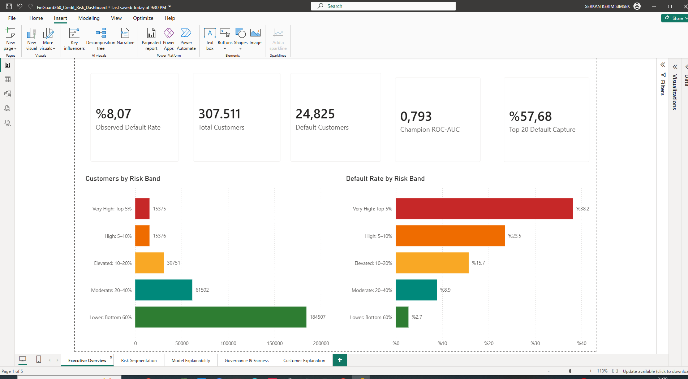
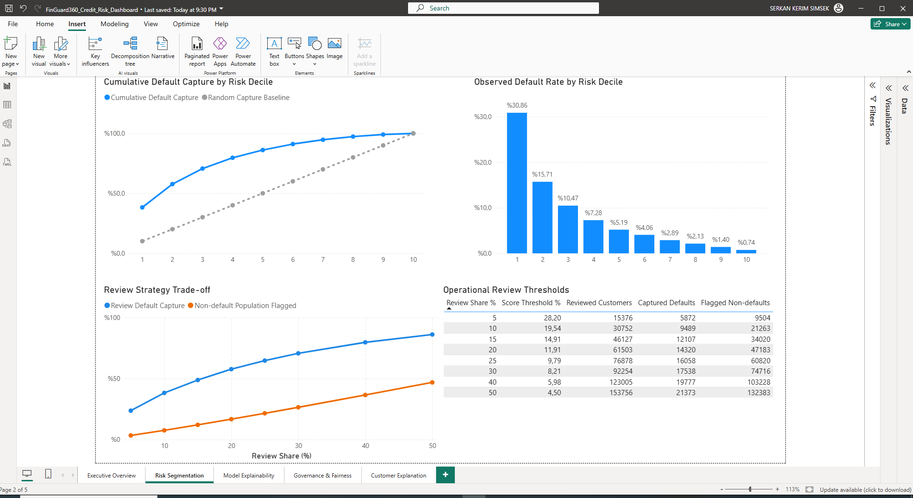
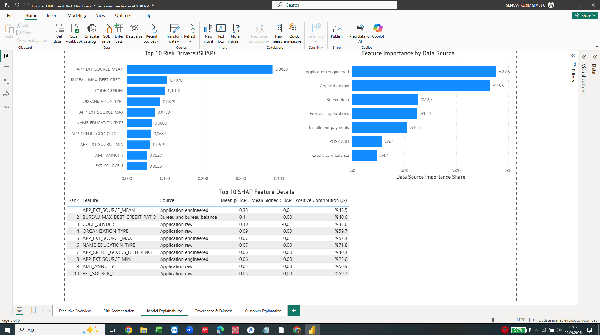
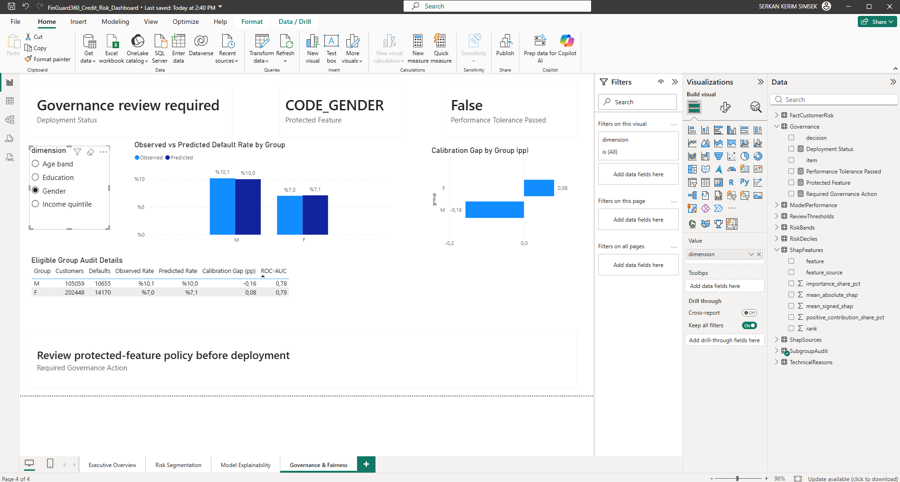
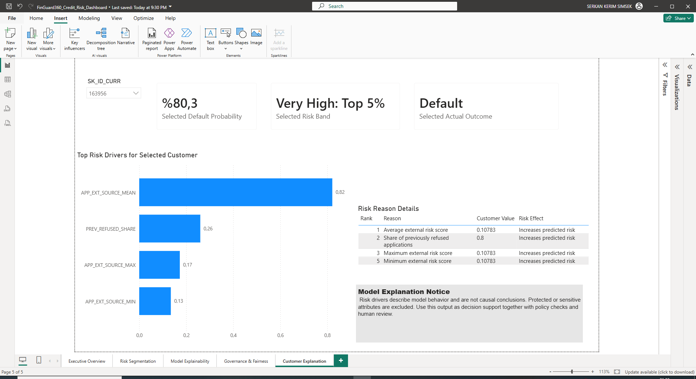

# FinGuard360 — Credit Risk Analytics & Model Governance Dashboard

FinGuard360 is an end-to-end credit-risk portfolio project built with Python, machine learning, SHAP, and Power BI. It turns model output into an operational decision-support system covering portfolio risk, review strategy, explainability, fairness, and customer-level reasoning.

> The dashboard supports human review and policy decisions. It is not an automated lending-decision system.

## Project snapshot

| Metric | Result |
|---|---:|
| Customers analyzed | 307,511 |
| Observed defaults | 24,825 |
| Observed default rate | 8.07% |
| Champion ROC-AUC | 0.793 |
| Defaults captured in top 20% | 57.68% |
| Default rate in highest-risk 5% | 38.2% |

## Business questions answered

- Which customers and portfolio segments carry the highest predicted risk?
- How much default volume can be captured at different review-capacity levels?
- Which features drive the model globally and for an individual customer?
- Are observed and predicted default rates calibrated across eligible groups?
- Is the model ready for deployment from both performance and governance perspectives?

## Dashboard

### 1. Executive Overview

Portfolio KPIs, customer distribution by risk band, and observed default rates across operational segments.



### 2. Risk Segmentation

Risk-decile performance, cumulative default capture, review-strategy trade-offs, and operational thresholds.



### 3. Model Explainability

Global SHAP feature importance, contribution by data source, and a ranked feature-detail table.



### 4. Governance & Fairness

Subgroup calibration, ROC-AUC comparison, protected-feature monitoring, and deployment-governance status.



### 5. Customer Explanation

Customer-level probability, risk band, actual outcome, non-sensitive risk drivers, and plain-language reason details.



## Key findings

- Risk is strongly concentrated: the highest-risk 5% has a 38.2% observed default rate, compared with 2.7% in the lowest-risk 60%.
- Reviewing the top 20% of customers captures 57.68% of observed defaults, enabling an explicit trade-off between review capacity and risk coverage.
- `APP_EXT_SOURCE_MEAN` is the leading global driver with mean absolute SHAP of 0.3839.
- Engineered application features and raw application features contribute 27.6% and 26.5% of total feature importance, respectively.
- `CODE_GENDER` appears among the global drivers. The dashboard therefore flags governance review before deployment and excludes protected or sensitive attributes from the customer-level explanation view.
- Model performance tolerance is not marked as passed; deployment should remain subject to policy review, validation, and human oversight.

## Risk-band design

| Risk band | Portfolio share | Customers | Observed default rate |
|---|---:|---:|---:|
| Very High | Top 5% | 15,375 | 38.2% |
| High | 5–10% | 15,376 | 23.5% |
| Elevated | 10–20% | 30,751 | 15.7% |
| Moderate | 20–40% | 61,502 | 8.9% |
| Lower | Bottom 60% | 184,507 | 2.7% |

## Workflow

1. Load and validate Home Credit application data.
2. Clean variables and engineer application, bureau, payment, POS, credit-card, and previous-application features.
3. Train and evaluate the credit-risk model.
4. Generate calibrated probabilities, deciles, risk bands, and review-threshold metrics.
5. Calculate global and customer-level SHAP explanations.
6. Export curated analytical tables to Power BI.
7. Build executive, operational, explainability, governance, and customer-level dashboard pages.

## Technology

- Python 3.12
- Pandas and NumPy
- Scikit-learn
- SHAP
- Jupyter Notebook
- Power BI and DAX

## Repository structure

```text
FinGuard360/
├── README.md
├── LICENSE
├── requirements.txt
├── data/
│   └── README.md
├── docs/
│   ├── DATA_DICTIONARY.md
│   └── MODEL_GOVERNANCE.md
├── images/
│   ├── 01-executive-overview.png
│   ├── 02-risk-segmentation.png
│   ├── 03-model-explainability.png
│   ├── 04-governance-fairness.png
│   └── 05-customer-explanation.png
├── notebooks/
│   └── FinGuard360_Credit_Risk_Analysis.ipynb
└── powerbi/
    └── README.md
```

## Data

This project uses the [Home Credit Default Risk](https://www.kaggle.com/competitions/home-credit-default-risk/data) dataset. Raw competition files are not stored in this repository because of their size and licensing/distribution conditions. Download them from Kaggle and follow the instructions in [`data/README.md`](data/README.md).

## Reproducing the project

```bash
python -m venv .venv
# Windows: .venv\\Scripts\\activate
# macOS/Linux: source .venv/bin/activate
pip install -r requirements.txt
jupyter notebook notebooks/FinGuard360_Credit_Risk_Analysis.ipynb
```

Download [`FinGuard360_Credit_Risk_Dashboard.pbix`](https://github.com/serkankerimsimsek/FinGuard360-Credit-Risk-Analytics/releases/download/v1.0.0/FinGuard360_Credit_Risk_Dashboard.pbix) from the `v1.0.0` release after the notebook exports the curated dashboard tables. If local file paths differ, update the Power BI data-source settings and refresh the model.

## Responsible-use notes

- Feature importance and SHAP values explain model behavior; they do not establish causality.
- Subgroup metrics are monitoring signals, not proof of fairness.
- Protected or sensitive features require explicit legal, compliance, and policy review.
- Thresholds should be chosen against review capacity, business cost, and governance constraints.
- The model should be independently validated and monitored before any production use.

## License

Project code and documentation are released under the MIT License. The Home Credit dataset remains subject to its original competition terms.
